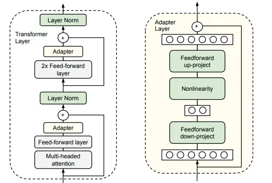

## Introduction

- 现阶段一个常见的学习范式是使用预训练的表征进行迁移学习。自Deep learning横空出世之后，一些预训练的特征向量和对预训练语言模型（PLM）的fine-tuning的方法就已经开始使用了。然而，由于模型的大小正在快速增长，因此对预先训练过的模型的整个参数集进行微调变得不切实际（普通玩家带不动）。但我们又admire在大数据训练下的大模型所带来的巨大性能提升和先验知识，于是就必须有一种parameter efficient的fine tune方式，使得我们针对不同的多模态下游任务都可以很快用大模型上手。
- Adapter给出了一个新的思路，即在模型中插入一些少量的参数，在下游某个任务微调时只对这些参数进行训练，而保持预训练模型原有的参数不变。
- Generally speaking, the advantages and disadvantages are as follows:
  - advantages:
    - High parameter efficiency:一个任务需要更少参数，训练速度快且占用内存少，有利于模型的存储和分发。
    - 对于下游specific task上的小数据集可以降低过拟合的风险。这在《**Multimodal Video Adapter for Parameter Effificient Video Text Retrieval**》这篇论文中提到的Video-text任务上有说明
    - 引入先验知识：adapter冻结了原有模型的大部分参数，保证了原来的知识不被遗忘。
    - 泛化性好：adapter用少量的参数学习多个任务，不同任务之间影响较少
  - disadvantages：
    - 不同任务带来的相互的监督可能会变少
    - 在训练和推理阶段还是需要引入额外的参数和计算成本
  - 初步展望（可做的方向）：对上述两个缺点进一步优化

## Mainstream framework

- 最早的（据我所知）提出adapter的是17年发表在NIPS上的在CV领域的工作**《Learning multiple visual domains with residual adapters》**，而后在19年google research在ICML发表的工作**《Parameter-Efficient Transfer Learning for NLP》**将此模型引入到NLP中，利用transformer为基本架构，插入adapter实现，模型框架图如下：

  ****

  其实就是在Multi-head attention和2层FFN层后都加了一个adapter。至于adapter的结构，就是向下投射到一个较小维度，经过一层非线性激活函数，然后向上投射到原有的维度。另外，整个adapter层的输入和输出之间还有一个残差连接。这一类的adapter也被形象地称作bottleneck adapter。

  思考：1）为什么要残差连接？一开始可以用小参数初始化adapter使其接近identity输出，保证在刚开始的时候模型依旧表现很好。和Resnet加深层次思路一致。        2）为什么向下&向上映射？减少参数量

  训练步骤：

  - Step1：初始化adapter参数都从均值为0标准差为0.01的正态分布中采样，保证刚开始训练时adapter主干的全连接网络的输出很小，主要由残差连接传递信息。

  - Step2：训练时冻结原有模型的全部参数，只训练adapter层的参数和layer normalization的参数。在上图中只有绿色部分和adapter是trainable的。

  - Step3:  实验比较一般在分类任务（GLUE）和抽取式问答任务（SQuAD v1.1）上进行，比较fine tune整个BERT-Large和BERT-Large加adapter只微调adapter的性能

  结论：

  - 微调adapter性能接近full fine tune，如果根据每个task调adapter，可以做到掉点比较少。
  - 使用adapter的参数效率高于只微调BERT靠近输出的若干层，性能高于只训练layer normalization的参数
  - 推理阶段，对某层的adapter进行pruning是可行的，不会对性能产生太大影响。但是对多层进行剪枝性能会大幅下降。相比靠近输出的层来说，靠近输入的层对剪枝更不敏感。**这也为接下来的工作挖了个坑。**

  

- 在此之后，针对Adapter训练过程的优化已经有了很多后续工作，其中针对Introduction中的缺点已经有了很多改进的工作。首先是缺点一，为了让多任务学习和adapter更好地结合，有篇提升任务间信息交互的工作—**AdapterFusion**. 该工作发表在21年EACL上。

  - Motivation：想要结合来自多个任务的知识，传统的两个方法是sequential fine-tuning或multi-task learning。前者的一大问题是需要先验知识来确定顺序，且模型容易遗忘之前任务学到的知识，后者的问题是不同的任务互相影响，也难以平衡数据集大小差距很大的任务。Adapter的一个优势是不用更新预训练模型的参数，而是插入比较少的新的参数就可以很好地学会一个任务。此时，adapter的参数某种程度上就表达了解决这个任务需要的知识。受此启发，AdapterFusion提出如果想要把来自多个任务的知识结合起来，就可以考虑把多个任务的adapter的参数结合起来。于是它的模型框架如下：

  

  - 训练过程：该模型是two-stage的，第一阶段需要针对于每个任务，学习一组新的adapter参数；第二阶段对某个特定目标任务，学习一个融合模块把第一步的所有adapter结合起来。和第一篇工作比起来，它摘掉了多头注意力之后的adapter, 只保留了最上面的adapter，而且在其后加入fusion模块。而fusion其实就是个注意力模块：Q是原来transformer层中全连接层的输出，K和V都是各个任务对应的adapter的输出。
  - 结论：
    - 第一阶段每个任务独立初始化一套adapter参数，只学习当前任务，不更新预训练模型的参数，就可以做到和整个模型微调相近或更好的表现
    - 第二阶段，加入AdapterFusion对训练集比较小的任务提升比较明显，第一阶段独立训练并且第二阶段使用AdapterFusion效果最好

- 而对于缺点二，引入adapter在推理阶段速度的drop引起了研究者们的研究兴趣，于是21EMNLP上有篇工作**AdapterDrop**就探讨了这个问题并研究了adapter如何剪枝以进一步提升效率。该工作首先评估了adapter的训练和推理速度，发现adapter的训练很有优势：会比整个模型微调快60%左右，而推理仍然不足：会比使用原模型慢4%-6%。结果如下表：

  

  为了解决上述inference慢的问题，作者结合了第一个工作的结论三，也就是之前说的挖的坑设计了剪枝模型，模型框架如下：

  

  - 分析：中间的模型就是正常的adapter的训练范式，而最右边的是作者提出的。可以看到，作者把靠近输入端的adapter剪掉了

  - 实验结果：当去除掉五层的adapter时，训练速度可以加快26%，多任务同时推理的速度可以加快21%-42%，超过了原模型的推理速度。

  - 作者进一步结合了AdapterFusion的工作，探讨了如何加速多任务融合的推理速度，框架如下图：

    

    - method 1:去除掉前几个AF层，对性能的影响不同的任务有所不同。但这明显不具有足够的泛化性

    - method 2:剪掉每层中对输出贡献较小的adapter,计算每个adapter的平均激活水平，只保留两个贡献最高的adapter，模型的性能和原来基本持平，推理速度可以提高68%

      

- 上面的两种改进都没有针对Adapter本身的结构进行调整，于是有研究者就探究如何将adapter做得更加轻量化，同时不降低性能。在NIPS2021上提出了**Compacter**，它保留了adapter放置位置和训练方式，优化了adapter的结构。

  - 这篇文章是将最近在*parameterized hypercomplex multiplication layers* (PHM)取得的进展用在transformer上。其出发点在于减少全连接层的参数量，用更高效的低秩矩阵替代。

  - 具体做法：将adapter的参数表达为nxn的矩阵A和一个(k/n)x(d/n)的矩阵B的Kronecker积。A作为slow的general information跨任务共享，而B作为fast的adapter-specific information。B可以再次被分解为秩1的向量相乘，进一步把time complexity减少到O(k+d).模型框架如下：

    

  - 实验结果：

    - AdapterDrop或者仅仅对adapter层进行低秩分解的性能都比整个模型微调要差。

    - Compacter的三个创新使得只训练0.1%上下的新参数就可以和全模型微调的表现相近。

    - 和full fine tune相比，Compacter在训练集较小（0.1k-4k）的时候表现要更好。

      

- Adapter的应用也开始受到关注，其中在*ACL-IJCNLP 2021*上的论文**K-Adapter**将adapter引入pre-train model。其目的是利用adapter向预训练模型中加入知识来解决知识密集型任务，侧重于改进预训练过程中 Multi-task 这个过程。可以和AdapterFusion一起看

  - Motivation：预训练模型中嵌入知识信息是很有必要的因为基于无监督学习的大规模预训练模型忽略了低频但重要的知识信息；Multi-task 会造成知识遗忘, 而且参数计算代价是巨大的

  - K-Adapter通过并行的 Adapter 层来获得不同类型的知识信息，最后通过 concatenate 来输出，互不影响。模型的框架如下：

    。

    

    可以看到K-Adapter不再改动原有的transformer，而是变成在两个transformer层之间插入adapter层。每个adapter层内，在向下和向上project的全连接层之间加入了两层transformer层，目的是增加模块的表达能力。每个adapter层的输入可以看到上一个adapter和邻近的上一个transformer层的输出。Concatenate 前一 Adapter 的输出和当前层 Transformer 的输出作为当前 Adapter 的输入，单个 knowledge task 的输出是最后一个 Adapter 的输出和最后一个 Transformer 输出 Concatenate 在一起。

  - 和前面的区别：K-Adapter侧重于预训练的知识嵌入，而在下游任务上仍然采用了fine-tuning的方式。也就是说Freeze Pre-trained models 参数只在 pre-trained 知识的过程中。

  

## Variants

- 之前的很多方法都是task specific的，为了使得跨多个适配器共享信息，从而能够向低资源和相关任务进行正向知识迁移，提出了**Hyperformer**的框架

  - 原理：使用hypernetwork生成adapter两个映射矩阵的参数。Hypernetwork接收任务id和层id的输入，输出对于某个任务在某一层对应的adapter参数。模型示意图如下：

    

    基于任务嵌入，超参数网络为dp up过程学习两个参数U,D；相似地为layer norm也分配两个参数

    

- PALS:发表在ICML 2019上

- Prefix Tuning：

- LoRA:

- MAM Adapter:ICLR 2022

